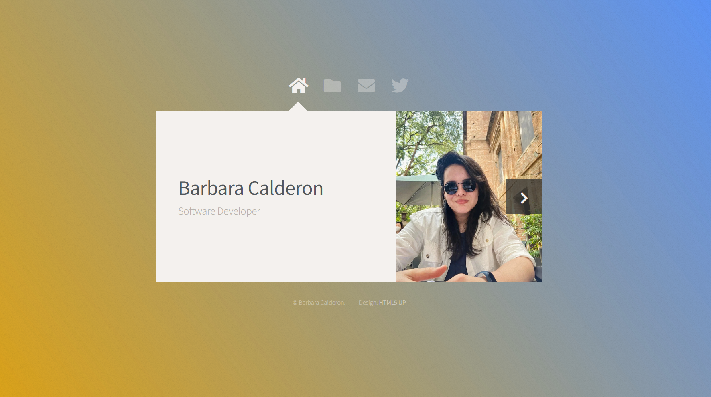
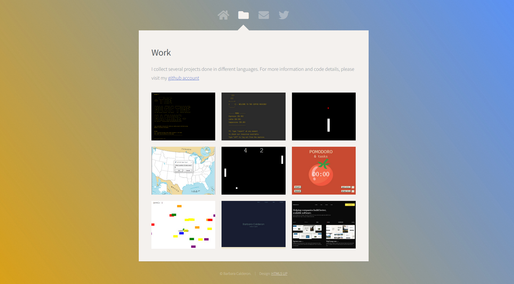

_English. Português._

_This was a practical challenge on rendering templates with Flask from Dr. Angela Yu's Python Bootcamp. Some other 
study notes on Flask you can [find here](https://github.com/barbaracalderon/notes-on-python/blob/main/05_FLASK.md)._

_Esse foi um desafio prático sobre renderizar templates com o Flask do curso da Dra. Angela Yu's Python Bootcamp. 
Outras anotações sobre o Flask você pode [encontrar aqui](https://github.com/barbaracalderon/notes-on-python/blob/main/05_FLASK.md)._

# Flask: HTML5 Up Template

My goal was to practice how to render templates using Flask. It's a smaller version of a portfolio, I would say. The
template design was by [HTML5 UP](https://html5up.net/), and it's called "Astral". I changed the background colors, 
edited text and added images from previous projects, while also making it compatible to run on Flask.

---

# Flask: Template do HTML5 Up

Meu objetivo era praticar a renderização de templates com o Flask. Eu diria que é uma versão menor de um portfolio. 
O design do template foi feito pelo [HTML5 UP](https://html5up.net/) e se chama "Astral". Eu troquei as cores do 
fundo, editei textos e adicionei imagens de projetos anteriores - além de torná-lo compatível com o Flask.